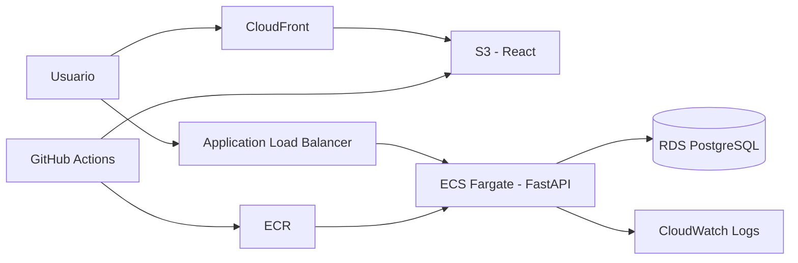

# Sistema de Turnos en AWS

Aplicación full stack para crear, consultar y cancelar turnos, diseñada como demostración de una arquitectura cloud reproducible. Combina React, FastAPI, PostgreSQL y una infraestructura administrada con Terraform sobre AWS.

## Arquitectura



La base de datos no es pública y solo acepta tráfico desde el backend. RDS administra la contraseña maestra en Secrets Manager y ECS la inyecta sin guardarla en el repositorio.

## Tecnologías

- **Frontend:** React 19, Vite y Axios.
- **Backend:** Python 3.12, FastAPI, SQLAlchemy y Pydantic.
- **Datos:** PostgreSQL en Amazon RDS.
- **Cloud:** ECS Fargate, ECR, ALB, S3, CloudFront y CloudWatch.
- **DevOps:** Docker, Terraform y GitHub Actions.

## Funcionalidades

- Acceso autenticado mediante tokens firmados y sesión persistente en el panel.
- Crear turnos futuros con validación de cliente, servicio y disponibilidad.
- Buscar y filtrar turnos con paginación desde la API.
- Cancelar un turno sin borrar su historial.
- Reprogramar turnos activos y prevenir reservas simultáneas para el mismo horario.
- Health check para el balanceador y documentación OpenAPI en `/docs`.
- Interfaz adaptable a escritorio y dispositivos móviles.
- Panel operativo con métricas, búsqueda, filtros y reprogramación en un modal.

## Ejecución local

### Backend

```bash
cd SistemaTurnosAWS/backend
python -m venv .venv
source .venv/bin/activate
pip install -r requirements-dev.txt
cp .env.example .env
uvicorn app.main:app --reload
```

La configuración de ejemplo utiliza SQLite para evaluar el proyecto sin PostgreSQL.

### Frontend

En otra terminal:

```bash
cd SistemaTurnosAWS/frontend
cp .env.example .env
npm ci
npm run dev
```

Abre `http://localhost:5173`. La API y su documentación quedan disponibles en `http://localhost:8000` y `http://localhost:8000/docs`.

Para la demostración local, inicia sesión con `admin@turnos.local` y
`TurnosDemo2026!`. Estas credenciales son exclusivamente locales: en producción
Terraform exige un secreto externo de Secrets Manager con las claves
`JWT_SECRET` y `ADMIN_PASSWORD`.

## Variables de entorno

| Componente | Variable | Descripción |
| --- | --- | --- |
| Backend | `DATABASE_URL` | URL completa para desarrollo local. |
| Backend | `CORS_ORIGINS` | Orígenes permitidos separados por comas. |
| Backend | `DB_HOST`, `DB_PORT`, `DB_NAME`, `DB_USER`, `DB_PASSWORD` | Configuración usada en ECS. |
| Backend | `DB_CONNECT_TIMEOUT`, `DB_STARTUP_ATTEMPTS`, `DB_STARTUP_DELAY_SECONDS` | Límites de conexión y reintentos de migración durante el arranque. |
| Backend | `JWT_SECRET`, `ADMIN_EMAIL`, `ADMIN_PASSWORD` | Firma de sesiones y cuenta inicial de operaciones. |
| Frontend | `VITE_API_URL` | URL pública de FastAPI. |

Nunca confirmes archivos `.env`, credenciales de AWS, archivos `tfvars` ni estados de Terraform.

## Pruebas y controles

```bash
cd SistemaTurnosAWS/backend && pytest
cd SistemaTurnosAWS/frontend && npm test && npm run lint && npm run build
terraform -chdir=SistemaTurnosAWS/terraform fmt -check -recursive
terraform -chdir=SistemaTurnosAWS/terraform validate
```

El pipeline exige al menos 85% de cobertura del backend y ejecuta estos controles antes de permitir el despliegue.

## Infraestructura y despliegue

1. Copia `backend.hcl.example` fuera del repositorio, completa el bucket de estado y ejecuta `terraform init -backend-config=/ruta/backend.hcl`. Define `environment`, `cors_origins` y, para producción, `auth_secret_arn`; luego ejecuta `terraform plan` y `terraform apply` dentro de `SistemaTurnosAWS/terraform`.
2. Configura los secrets de GitHub Actions `S3_BUCKET` y `CLOUDFRONT_DISTRIBUTION_ID`. Para autenticar AWS, configura `AWS_DEPLOY_ROLE_ARN` mediante OIDC (recomendado, sin credenciales permanentes). Como alternativa, el workflow acepta `AWS_ACCESS_KEY_ID` y `AWS_SECRET_ACCESS_KEY`, pero las dos deben estar presentes. No mezcles métodos: si existe `AWS_DEPLOY_ROLE_ARN`, el workflow prioriza OIDC.
3. Un push a `main` valida el proyecto, publica la imagen Docker y actualiza frontend y backend.

> La infraestructura genera costos. Al terminar una demostración, ejecuta `terraform destroy` y comprueba que no queden recursos activos.

## Decisiones de seguridad

- RDS permanece sin acceso público y utiliza almacenamiento cifrado.
- El backend solo acepta tráfico proveniente del ALB.
- S3 bloquea el acceso público y CloudFront utiliza Origin Access Control.
- GitHub Actions asume un rol temporal mediante OIDC, sin access keys permanentes.
- Secrets Manager entrega la contraseña de base de datos directamente a ECS.
- CloudFront publica frontend y API bajo HTTPS en el mismo origen, evitando mixed content.
- ECS escala automáticamente entre una y cuatro tareas según CPU y CloudWatch detecta targets no saludables.

## Señales de calidad

- Migraciones versionadas con Alembic y una restricción única parcial que garantiza la disponibilidad aun con múltiples tareas ECS.
- Contratos HTTP probados de extremo a extremo con `TestClient` y cobertura mínima en CI.
- Respuestas paginadas, filtros, búsqueda, conflictos `409` y validación de fechas futuras.
- Request ID propagado en cada respuesta y logs con latencia para facilitar el diagnóstico.
- Imagen Docker trazable mediante la etiqueta SHA del commit.
- Despliegue inmutable por SHA, circuit breaker de ECS, espera de estabilidad y smoke test posterior.
- Arranque tolerante a demoras de RDS, contraseñas con caracteres reservados y migraciones simultáneas durante rolling deployments.
- Logs JSON, dashboard operativo, alarmas opcionales por SNS y readiness check de base de datos.

Consulta [Arquitectura y decisiones](docs/ARCHITECTURE.md) para conocer los trade-offs, el modelo de amenazas y la estrategia de evolución.

## Próximos pasos

- Sustituir la cuenta operativa inicial por autenticación federada con Cognito cuando el producto incorpore clientes finales.
- Ejecutar migraciones como una tarea ECS única previa al rolling deployment.
- Incorporar pruebas E2E del navegador cuando el entorno de CI disponga del runtime de Playwright.

## Licencia

Distribuido bajo la [Licencia MIT](LICENSE).
