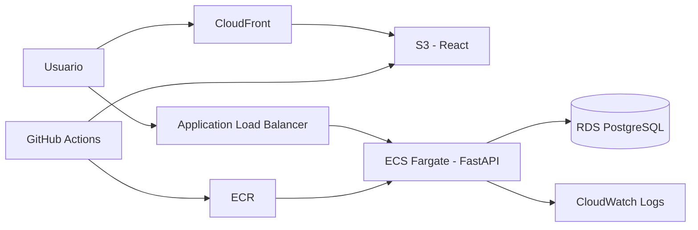

# Sistema de Turnos en AWS

Aplicación full stack para crear, consultar y cancelar turnos, diseñada como demostración de una arquitectura cloud reproducible. Combina React, FastAPI, PostgreSQL y una infraestructura administrada con Terraform sobre AWS.

## Arquitectura



La base de datos no es pública y solo acepta tráfico desde el backend. RDS administra la contraseña maestra en Secrets Manager y ECS la inyecta sin guardarla en el repositorio.

## Tecnologías

- **Frontend:** React 19, Vite y Axios.
- **Backend:** Python 3.12, FastAPI, SQLAlchemy y Pydantic.
- **Datos:** PostgreSQL en Amazon RDS.
- **Cloud:** ECS Fargate, ECR, ALB, S3, CloudFront y CloudWatch.
- **DevOps:** Docker, Terraform y GitHub Actions.

## Funcionalidades

- Crear turnos con validación de cliente, servicio y fecha.
- Listar los turnos registrados y sus estados.
- Cancelar un turno sin borrar su historial.
- Health check para el balanceador y documentación OpenAPI en `/docs`.
- Interfaz adaptable a escritorio y dispositivos móviles.

## Ejecución local

### Backend

```bash
cd SistemaTurnosAWS/backend
python -m venv .venv
source .venv/bin/activate
pip install -r requirements-dev.txt
cp .env.example .env
uvicorn app.main:app --reload
```

La configuración de ejemplo utiliza SQLite para evaluar el proyecto sin PostgreSQL.

### Frontend

En otra terminal:

```bash
cd SistemaTurnosAWS/frontend
cp .env.example .env
npm ci
npm run dev
```

Abre `http://localhost:5173`. La API y su documentación quedan disponibles en `http://localhost:8000` y `http://localhost:8000/docs`.

## Variables de entorno

| Componente | Variable | Descripción |
| --- | --- | --- |
| Backend | `DATABASE_URL` | URL completa para desarrollo local. |
| Backend | `CORS_ORIGINS` | Orígenes permitidos separados por comas. |
| Backend | `DB_HOST`, `DB_PORT`, `DB_NAME`, `DB_USER`, `DB_PASSWORD` | Configuración usada en ECS. |
| Frontend | `VITE_API_URL` | URL pública de FastAPI. |

Nunca confirmes archivos `.env`, credenciales de AWS, archivos `tfvars` ni estados de Terraform.

## Pruebas y controles

```bash
cd SistemaTurnosAWS/backend && pytest
cd SistemaTurnosAWS/frontend && npm run lint && npm run build
terraform -chdir=SistemaTurnosAWS/terraform fmt -check -recursive
terraform -chdir=SistemaTurnosAWS/terraform validate
```

El pipeline ejecuta estos controles antes de permitir el despliegue.

## Infraestructura y despliegue

1. Autentícate en AWS, define `cors_origins` con la URL real de CloudFront y ejecuta `terraform init`, `terraform plan` y `terraform apply` dentro de `SistemaTurnosAWS/terraform`.
2. Configura los secrets de GitHub `AWS_ACCESS_KEY_ID`, `AWS_SECRET_ACCESS_KEY`, `S3_BUCKET`, `CLOUDFRONT_DISTRIBUTION_ID` y `VITE_API_URL`.
3. Un push a `main` valida el proyecto, publica la imagen Docker y actualiza frontend y backend.

> La infraestructura genera costos. Al terminar una demostración, ejecuta `terraform destroy` y comprueba que no queden recursos activos.

## Decisiones de seguridad

- RDS permanece sin acceso público y utiliza almacenamiento cifrado.
- El backend solo acepta tráfico proveniente del ALB.
- S3 bloquea el acceso público y CloudFront utiliza Origin Access Control.
- El pipeline lee las credenciales desde GitHub Secrets.
- Secrets Manager entrega la contraseña de base de datos directamente a ECS.

## Próximos pasos

- Añadir autenticación y roles de usuario.
- Incorporar dominio propio y HTTPS mediante ACM en el ALB.
- Agregar alarmas, métricas de negocio y análisis de seguridad.

## Licencia

Distribuido bajo la [Licencia MIT](LICENSE).
